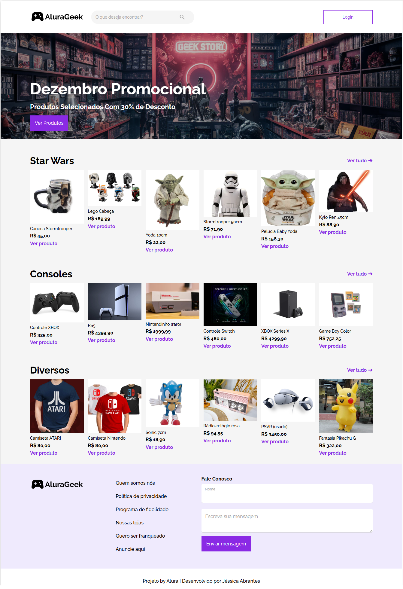

# Alura Geek | Challenge Front-End 2024

# Detalhes do projeto

Este projeto é o resultado da minha participação na Desafio de Front End da Alura. Por meio de uma abordagem de aprendizado baseado em desafios, nós colocamos nossos conhecimentos em ação resolvendo um desafio do mundo real. A [Alura](https://www.alura.com.br) é uma escola online de tecnologia brasileira.

# O desafio: página de e-commerce da AluraGeek

A **AluraGeek** é uma empresa (fictícia) brasileira que vende produtos relacionados à cultura Geek. Eles planejam expandir seus negócios para todo o Brasil e por isso **nos contrataram para implementar a página de e-commerce deles**. 

Como um **desenvolvedor Front End**, minhas tarefas são desenvolver 4 páginas incluindo: 

- **Página Inicial**: o conteúdo principal é composto por um banner para destacar alguma promoção ou qualquer outra informação que a empresa achar relevante, e três galerias para diferentes categorias de produtos;

- **Login**: uma página simples de login para digitar um e-mail e senha (área de login para tarefas administrativas);

- **Produtos**: uma página administrativa que irá mostrar todos os produtos disponíveis, com botões para editar/remover produtos;

- **Adicionar Produto**: outra página administrativa para adicionar um novo produto ao site.

A empresa ficará *muito feliz* se eu também entregar uma quinta página: **Detalhes do Produto**, uma página para mostrar informações sobre um único produto e uma galeria com produtos relacionados.

É de **suma importância** para a AluraGeek que seu site de e-commerce seja **responsivo**, para que todos os clientes tenham uma boa experiência de compra, seja pelo celular, tablet ou computador.

O layout para cada página está disponível em um [arquivo Figma](https://www.figma.com/file/fR9qvy3gU53s2q5efeMpy9/AluraGeek---Challenge). 

## Semana 1

Durante a primeira semana, meu foco foi em desenvolver a página inicial.

## Semana 2

Para a segunda semana, o foco foi desenvolver as páginas administrativas: login, remover/editar produtose adicionar um novo produto e detalhes do produto.

## Semanas 3 e 4

As últimas duas semanas são dedicadas a aplicar o JavaScript para habilitar diferentes funcionalidades: 

- validação de campos de formulário;
- autenticação (página de login);
- mostrar os produtos dinamicamente;
- mostrar os resultados ao se fazer uma busca por um produto (utilizando o campo de busca);
- executar as ações necessárias quando se clica em um link ou botão.

## Páginas criadas

- Home
- Login
- Adicionar um produto
- Mostrar todos os produtos
- Mostrar os produtos de uma categoria
- Detalhes de um único produto
- Resultado de uma busca

## Imagem da página Home
